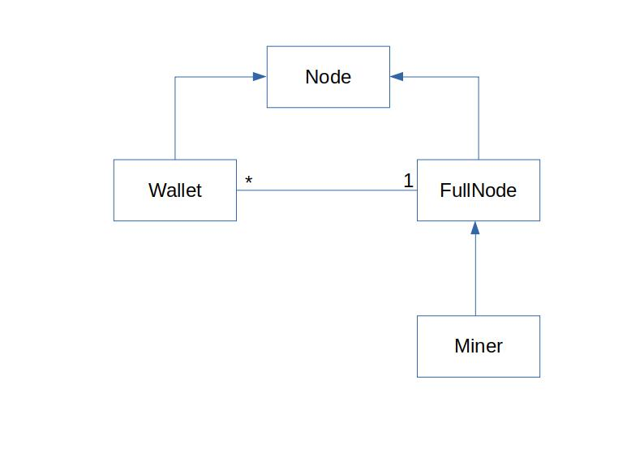

# Introduction
Projet de création d'une blockchain bitcoin locale simplifiée
basée sur une architecture pair à pair construite manuellement.

# Architecture


# Exécution des tests
```shell
cd mini-btc
export PYTHONPATH=`pwd`
python3 tests/tests_node.py
```
